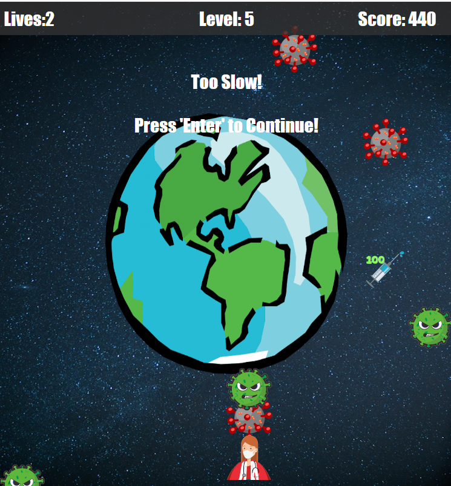

# Object Oriented Programming Game Project

## The game

This game is called **VIRUS ELIMINATOR**. In the game, you play as a doctor in space protecting the world from viruses. You can move left and right, up and down with the arrows of your keyboard and launch medical masks with the space bar.

The goal of the game is to stay alive as long as possible by avoiding the Viruses who are raining from space. The more viruses you destroy, the higher your score!

## Improvements

1. Added lives to the game. Player starts off with 3 and can add to their lives by catching the special item.
2. Added a player score to the game. Shoot the viruses to rack up a high score!!!
3. Added the ability for the player to shot down enemy viruses with the space bar.
4. Added a new super enemy that can't be shot down.
5. Added 'animations' for when a shot hits a virus and a super virus.
6. Added special item that gives you an extra life and points.
7. Added the ability to move up and down in the game.
8. Added levels to the game that increase the speed/number of objects flying down at you. There are infinite levels!!!
9. Added the ability to put in a high score at the end of the game if your score is high enough!
10. Made the game screen wider. Centered the game screen. Changed animations of the player/enemies.

